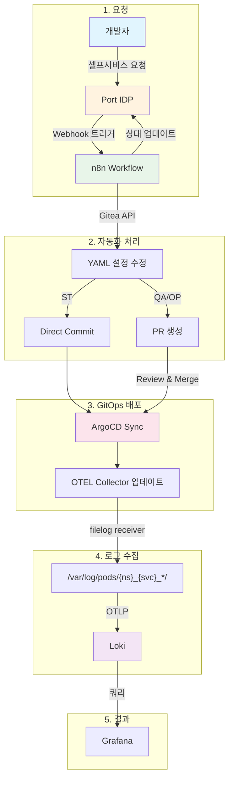

# OTEL Pipeline Automation

Port IDP를 통해 개발팀이 셀프서비스로 로그 수집을 요청하면, n8n 워크플로우가 Gitea에서 OTEL Collector 설정을 자동으로 업데이트합니다.

## 아키텍처

```
Port IDP → n8n Webhook → Gitea GitOps → ArgoCD Sync → OTEL Collector 업데이트
```

### 파이프라인 자동화 플로우



## 환경별 배포 전략

| 환경 | 클러스터 | 배포 방식 |
|------|---------|----------|
| ST (Staging) | `st`, `*-st` | Direct Commit → 자동 배포 |
| QA | `qa`, `*-qa` | PR 생성 → 리뷰 후 Merge |
| OP (Production) | `op`, `*-op` | PR 생성 → 리뷰 후 Merge |

## 구성요소

### 1. Port IDP Blueprint (`port-blueprint.json`)

개발팀이 셀프서비스로 로그 수집 요청:

| 필드 | 설명 | 예시 |
|------|------|------|
| `service_name` | 서비스명 (K8s deployment 이름) | `user-api` |
| `namespace` | K8s 네임스페이스 | `st`, `qa`, `op` |
| `cluster` | 클러스터 환경 | `st`, `qa`, `op` |
| `pipeline_type` | OTEL 파이프라인 타입 | `standard`, `cloudlet`, `apigw` 등 |

### 2. n8n 워크플로우 (`configs/n8n-workflow-gitea-simple.json`)

#### 워크플로우 노드 구성

```
Webhook Trigger → Validate Action → Gitea Read File → Modify YAML → Requires PR?
                        ↓                                              ↓         ↓
                Port Invalid Action                           Create Branch   Direct Commit
                                                                    ↓              ↓
                                                              Create PR     Port Success (ST)
                                                                    ↓
                                                           Port Success (QA/OP)
```

#### 주요 노드 설명

| 노드 | 역할 |
|------|------|
| **Webhook Trigger** | Port IDP webhook 수신 (`POST /webhook/otel-pipeline-port`) |
| **Validate Action** | `action.identifier === "create_observability"` 검증 |
| **Gitea Read File** | `{cluster}/agent-node-log.yaml` 파일 읽기 |
| **Modify YAML** | `filelog/{pipeline_type}` 섹션에 로그 경로 추가 |
| **Requires PR?** | QA/OP면 PR 생성, ST면 직접 커밋 |
| **Port Success** | Port에 성공 상태 콜백 |

#### 노드별 상세 설명

**1. Webhook Trigger**
- Port IDP에서 webhook 요청 수신
- 입력 페이로드:
```json
{
  "context": { "runId": "run-123" },
  "payload": {
    "properties": {
      "service_name": "my-service",
      "namespace": "st",
      "cluster": "cluster-st",
      "pipeline_type": "standard"
    }
  },
  "action": { "identifier": "create_observability" }
}
```

**2. Validate Action**
- Port 액션 유효성 검증
- 조건: `action.identifier === "create_observability"`
- 실패 시 Port Invalid Action으로 에러 콜백

**3. Gitea Read File**
- Gitea API로 현재 OTEL 설정 파일 읽기
- API: `GET /repos/cluster/otel-settings/contents/{cluster}/agent-node-log.yaml`

**4. Modify YAML**
- YAML에 새 서비스 로그 경로 추가
- 중복 체크 (이미 있으면 에러)
- 로그 경로 형식: `/var/log/pods/{namespace}_{service_name}*/{service_name}*/*.log`

**5. Requires PR?**
- 환경별 분기 처리
- ST: Direct Commit → main 브랜치에 직접 커밋
- QA/OP: PR 생성 → 피처 브랜치 생성 후 PR

**6. Port Success**
- Port API로 성공 상태 콜백
- ST: "Log collection configured. ArgoCD will sync automatically."
- QA/OP: "PR created. Awaiting review." + PR URL

### 3. Gitea 저장소 구조

```
otel-settings/
├── st/
│   └── agent-node-log.yaml
├── qa/
│   └── agent-node-log.yaml
└── op/
    └── agent-node-log.yaml
```

## 빠른 시작

### 1. n8n 워크플로우 임포트

1. n8n에서 `configs/n8n-workflow-gitea-simple.json` 임포트
2. Credentials 설정:
   - **Gitea Token**: HTTP Header Auth (`Authorization: token {YOUR_TOKEN}`)
   - **Port Token**: HTTP Header Auth (`Authorization: Bearer {YOUR_TOKEN}`)

### 2. Port Blueprint 생성

1. Port에서 `port-blueprint.json`으로 Blueprint 생성
2. Action 생성:
   - **Identifier**: `create_observability`
   - **Webhook URL**: `https://your-n8n.com/webhook/otel-pipeline-port`

### 3. 테스트

Port에서 "Add Service to Log Collection" 액션 실행:

```json
{
  "service_name": "my-service",
  "namespace": "ns-myapp",
  "cluster": "st",
  "pipeline_type": "standard"
}
```

## 자동 생성되는 구성

요청 시 `agent-node-log.yaml`에 다음 경로가 추가됩니다:

```yaml
receivers:
  filelog/standard:
    include:
      - /var/log/pods/ns-myapp_my-service*/my-service*/*.log  # 자동 추가
```

## 프로젝트 구조

```
.
├── configs/
│   ├── n8n-workflow-gitea-simple.json  # n8n 워크플로우
│   ├── example-otel-config.yaml        # OTEL 설정 예시
│   └── *.yaml                          # 기타 설정 참조
├── port-blueprint.json                 # Port Blueprint 정의
├── demo/                               # 데모 스크립트
├── scripts/                            # 유틸리티 스크립트
└── README.md
```

## 요구사항

- n8n (워크플로우 실행)
- Port IDP (셀프서비스 포털)
- Gitea (설정 저장소)
- ArgoCD (GitOps 배포)
- OpenTelemetry Collector (로그 수집)
- Loki (로그 저장)

## 라이센스

MIT
