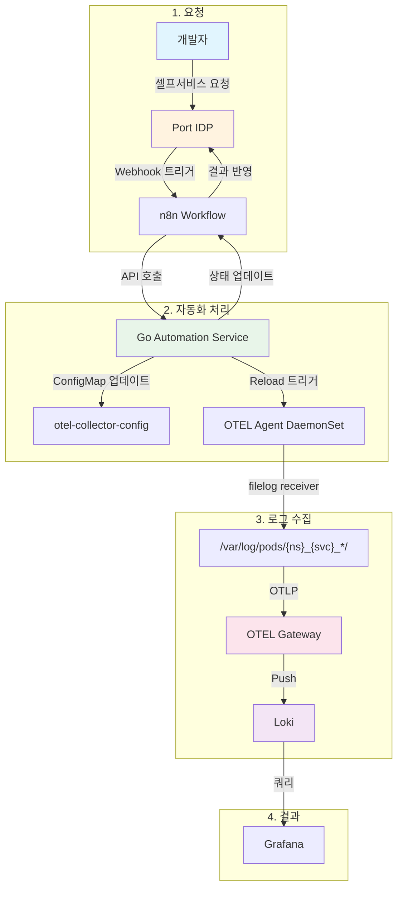

# OTEL Pipeline Automation

DevOps 자동화 시스템으로 개발팀이 Port IDP를 통해 요청하면 n8n 워크플로우를 거쳐 기존 OpenTelemetry Collector DaemonSet에 새로운 서비스 파이프라인을 자동으로 추가합니다.

## 아키텍처

```
Port IDP → n8n Webhook → Go Service → ConfigMap 업데이트 → DaemonSet Reload → 서비스 로그 수집
```

### 파이프라인 자동화 플로우



### Gateway 모델 지원

Agent-Gateway 구조를 지원합니다:
- **Agent (DaemonSet)**: 각 노드에서 filelog receiver로 로그 수집 → OTLP로 Gateway에 전송
- **Gateway (Deployment)**: OTLP receiver → processors → Loki exporter

서비스 추가 시 Agent의 filelog include path만 추가하면 됩니다.

## 핵심 개념

**기존 OTEL Collector DaemonSet 활용**: 새로운 Collector를 생성하지 않고, 기존 DaemonSet의 ConfigMap을 동적으로 업데이트합니다.

**Receiver 중심 접근**: 서비스별로 `filelog/{service-name}` receiver만 추가하고, 기존 파이프라인의 receivers 배열에 연결합니다.

**기존 인프라 활용**: 이미 구축된 processor, exporter, tenant 설정을 그대로 사용합니다.

## 구성요소

### 1. Port IDP Blueprint
- 개발팀이 셀프서비스로 로그 수집 요청
- **최소 입력**: 서비스명, 네임스페이스만 입력
- 승인 워크플로우 지원

### 2. n8n 워크플로우
- Port webhook 수신 및 검증
- 자동화 파이프라인 실행
- Port에 결과 상태 업데이트

### 3. Go Automation Service
- 서비스별 `filelog` receiver 생성
- 기존 logs 파이프라인에 receiver 추가
- ConfigMap 업데이트 및 DaemonSet 리로드

### 4. 자동 생성되는 구성요소
- **Receiver**: `filelog/{service-name}` - `/var/log/pods/{namespace}_{service-name}_*/` 경로 수집
- **Pipeline 연결**: 기존 logs 파이프라인의 receivers 배열에 추가
- **자동 라벨링**: 기존 processor가 service.name, service.namespace 자동 추출

## 빠른 시작

### 1. 빌드 및 배포

```bash
# Docker 이미지 빌드
make docker-build

# Kubernetes 배포
make deploy
```

### 2. Kind 클러스터에서 로컬 개발

```bash
# Kind 클러스터에 이미지 로드
kind load docker-image otel-pipeline-automation:latest --name kind

# 배포 (namespace 수정 필요시 deployments/kubernetes.yaml 편집)
kubectl apply -f deployments/kubernetes.yaml

# Pod 상태 확인
kubectl get pods -n ns-logging -l app=otel-pipeline-automation
```

### 3. Port 설정
1. `port-blueprint.json`을 사용해서 Blueprint 생성
2. Action 생성하여 webhook URL 설정: `http://otel-pipeline-automation:8080/api/v1/webhook/port`

### 4. n8n 설정
1. `configs/n8n-workflow.json` 임포트
2. Port API 토큰 Credential 설정

### 5. 환경 변수 설정
```bash
# ConfigMap 수정
kubectl edit configmap otel-config -n ns-logging
```

## API 엔드포인트

| Method | Path | 설명 |
|--------|------|------|
| POST | `/api/v1/webhook/port` | Port webhook 수신 |
| POST | `/api/v1/otel/pipeline/add` | 서비스 파이프라인 추가 |
| DELETE | `/api/v1/otel/pipeline/:service` | 서비스 파이프라인 제거 |
| GET | `/api/v1/otel/status/:service/:namespace` | OTEL DaemonSet 상태 조회 |
| GET | `/api/v1/health` | 헬스 체크 |

## 로컬 테스트 방법

### 1. Port-forward 실행
```bash
kubectl port-forward -n ns-logging svc/otel-pipeline-automation 8080:8080
```

### 2. API 테스트 (다른 터미널에서)

```bash
# Health check
curl http://localhost:8080/api/v1/health

# 서비스 파이프라인 추가
curl -X POST http://localhost:8080/api/v1/otel/pipeline/add \
  -H "Content-Type: application/json" \
  -d '{
    "service_name": "my-service",
    "namespace": "ns-test",
    "team": "platform"
  }'

# 서비스 파이프라인 삭제
curl -X DELETE http://localhost:8080/api/v1/otel/pipeline/my-service

# OTEL Collector 상태 확인
curl http://localhost:8080/api/v1/otel/status/my-service/observability
```

## 사용 예시

### Port에서 요청
```json
{
  "service_name": "user-api",
  "namespace": "production",
  "team": "platform",
  "custom_labels": {
    "env": "prod",
    "tier": "backend"
  }
}
```

### 자동 생성되는 구성
- **Receiver**: `filelog/user-api` - `/var/log/pods/production_user-api_*/` 경로 수집
- **Pipeline 추가**: 기존 `logs` 파이프라인에 `filelog/user-api` 추가
- **자동 라벨링**: 기존 processor가 파일 경로에서 service.name, service.namespace 자동 추출
- **자동 로그 파싱**: JSON/일반 텍스트 로그 모두 지원
- **기존 설정 활용**: tenant, exporter, 필터링 등 기존 설정 그대로 사용

## 개발

### 로컬 실행
```bash
export N8N_WEBHOOK_URL="http://localhost:5678/webhook/otel-automation"
export LOKI_ENDPOINT="http://localhost:3100/loki/api/v1/push"
export CLUSTER_NAME="local"

make run
```

### 테스트
```bash
make test
```

### Docker 빌드
```bash
# 의존성 정리
go mod tidy

# Docker 이미지 빌드
make docker-build

# 이미지 확인
docker images | grep otel-pipeline-automation
```

## 요구사항

- Go 1.21+
- Docker
- Kubernetes 클러스터 (또는 Kind)
- **기존 OpenTelemetry Collector DaemonSet** (ConfigMap 기반 설정)
- n8n
- Port IDP
- Loki (이미 구축됨)

## 전제 조건

기존 환경에 다음이 이미 구축되어 있어야 합니다:

1. **OTEL Collector DaemonSet**: `observability` 네임스페이스에 `otel-collector` 이름으로 실행 중
2. **ConfigMap**: `otel-collector-config` 이름으로 OTEL 설정 관리
3. **기존 logs 파이프라인**: processor, exporter가 이미 구성됨
4. **Loki**: 로그 집계 시스템 구축 완료 (tenant, 라벨링 설정 포함)
5. **자동 라벨링**: processor가 파일 경로에서 service.name, service.namespace 추출하도록 설정됨

## 프로젝트 구조

```
.
├── cmd/
│   └── main.go              # 애플리케이션 엔트리포인트
├── configs/
│   └── n8n-workflow.json    # n8n 워크플로우 설정
├── deployments/
│   └── kubernetes.yaml      # Kubernetes 배포 매니페스트
├── internal/
│   ├── handlers/            # HTTP 핸들러
│   ├── k8s/                 # Kubernetes 클라이언트
│   └── otel/                # OTEL 파이프라인 관리
├── pkg/
│   └── models/              # 데이터 모델
├── Dockerfile
├── Makefile
└── README.md
```

## 라이센스

MIT
